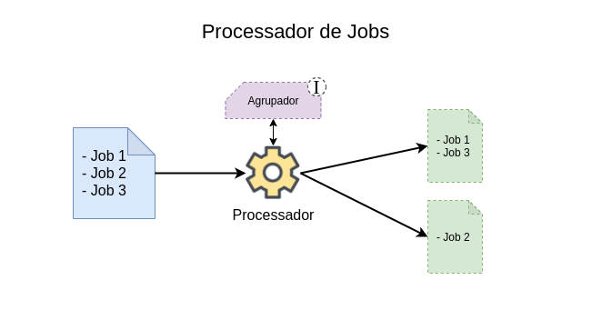

# Diagrama do processador de jobs

- Entrada de lista de jobs;
- Processamento dos jobs usando modelo (interface) de agrupamento;
- Saída de lista de jobs agrupados baseado nas regras da interface de agrupamento;
